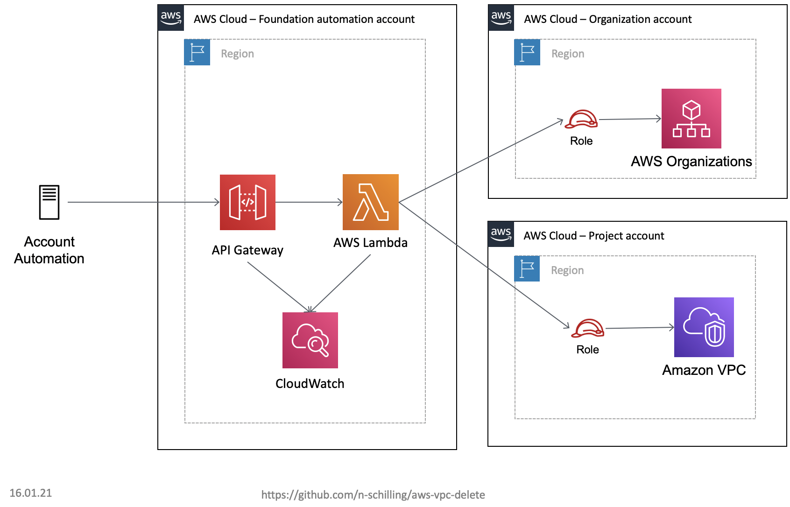

# AWS VPC Delete
AWS Serverless template to delete default VPCs in newly created AWS accounts as part of the account creation.

This solution works asynchronously. So, you will get an HTTP 200 immediately after you've sent the request. This response is not an indicator that all default VPCs were being deleted. Deleting default VPCs in all available regions takes roughly 60 seconds.

On purpose, this script does not delete instances, VPC peerings, VPC endpoints, or other resources used by a default VPC not to interrupt projects which are actively using a default VPC. If this solution is executed right after the account creation, it is enough to delete the default VPC.

## Base architecture



### Used AWS Services

* AWS Lambda
* AWS API Gateway
* AWS Cloudwatch

## Implementation guide

Please follow all the steps below to deploy the solution.

### Requirements

* Serverless (tested with version 2.19.0)

### Deployment Requirements

1. Deploy the CloudFormation template "vpc_delete_orga_iam_role.yaml" in the AWS Organization main account
2. Deploy the CloudFormation template "vpc_delete_project_iam_role.yaml" in the newly created AWS project account

### Deployment

1. Clone this repository
2. Edit the parameters in the serverless.yml
  * organization_account_id: The AWS account it of the AWS Organization main account
3. run ```sls deploy``` to deploy the solution

:exclamation: The serverless output while action 3 will mention: 

> WARNING: Function function has timeout of 180 seconds, however, it's attached to API Gateway so it's automatically limited to 30 seconds.

The function is called asynchronously; therefore, you can ignore this message.

The endpoint URL and the key can be found in the output of the serverless deployment. The account id for the account where the default VPC needs to be deleted must be provided via URL parameter ```account_id```.

### Undeploy

1. run ```sls remove``` to remove the solution
